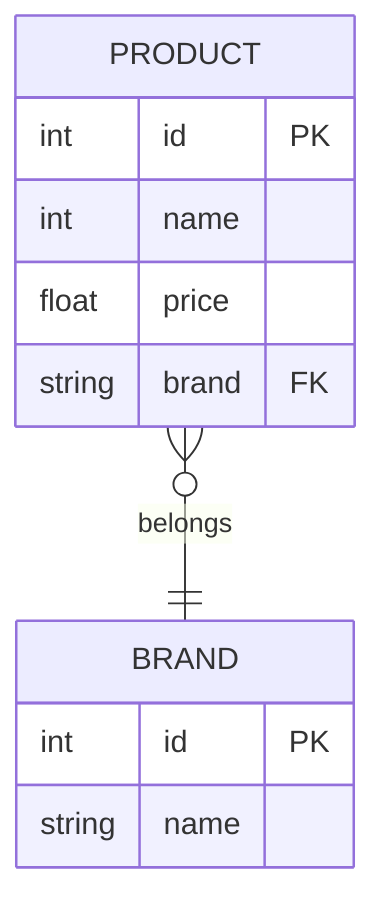

# Diagrama Entidad-Relación

```mermaid
erDiagram
    PRODUCT }o--|| BRAND : belongs
    BRAND {
        int id PK
        string name
    }
    
    PRODUCT {
        int id PK
        int name
        float price
        string brand FK
    }
```
